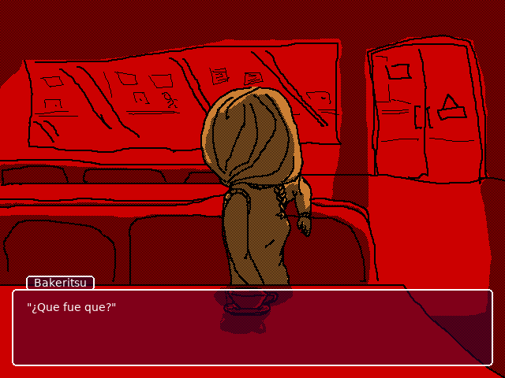

<!--
SPDX-FileCopyrightText: 2023 Grupo Warominutes
SPDX-License-Identifier: Unlicense
-->

# Gothic World, chapter 1

La adaptación que nadie pidió, la experiencia que ninguno quiere volver a repetir.

(Esto jamás será terminado)

## Imagenes viejas

## Progreso

 * Código: 95%
 * Texto: 5%
 * Música: 2%
 * Gráficos: ~0%

Tiempo estimado restante: 24 años.

## ¿Como juego esto?

 1. No lo haga, casi no tiene gráficos. Es mejor leer el texto directamente (todo lo que esta en gw1/res/data)
 2. Ya que insiste, descargue y extraiga el archivo zip de este proyecto (arriba donde dice Code > Download ZIP)
 3. Descargue [love2d](https://love2d.org)
 4. Abra con este la carpeta 'gw1' (supongo que arrastrando la carpeta al programa, o usando 'Abrir con...' o que se yo)
 5. Llore. Solo llore.
 6. Si de pronto sale una pantalla de error, lea el punto 1. No era chiste. I never chiste.
