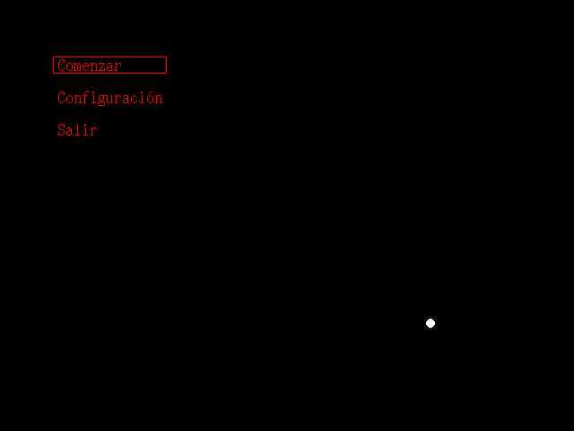

# Gothic World, chapter 1

La adaptación que nadie pidió, la experiencia que ninguno quiere volver a repetir.

(Esto jamás será terminado)

## Imagenes viejas

## Progreso
 * Código: 95%
 * Texto: 5%
 * Música: 1%
 * Gráficos: ~0%
Tiempo estimado restante: 24 años.

## ¿Como juego esto?
 * No tiene casi ningún gráfico así que es mejor leer el texto directamente (todo lo que esta en gw1/res/data)
 * O ya que insiste:
   1. Descargue y extraiga el archivo zip de este proyecto (arriba donde dice Code > Download ZIP)
   2. Descargue [love2d](https://love2d.org)
   3. Abra con este la carpeta 'gw1' (supongo que arrastrando la carpeta al programa, o usando 'Abrir con...' o que se yo)
   4. Llore. Solo llore.
   5. Si de pronto sale una pantalla de error, lea el punto que dice que es mejor leer el texto directamente. No era chiste. I never chiste.
